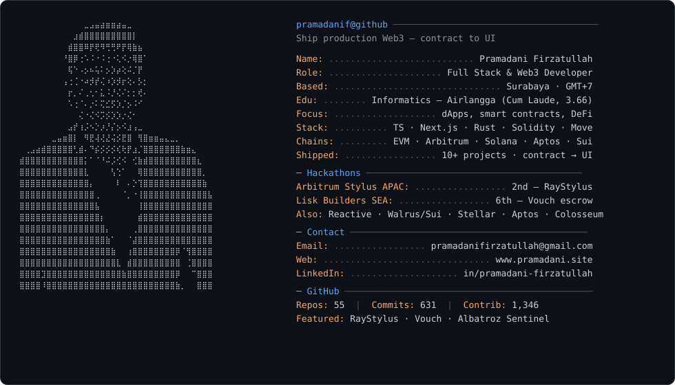

<picture>
  <source media="(prefers-color-scheme: dark)" srcset="dark_mode.svg">
  <source media="(prefers-color-scheme: light)" srcset="light_mode.svg">
  
</picture>

<strong>More</strong> — projects, stack, links

 

**Pramadani Firzatullah** — Full Stack & Web3 Developer · Surabaya (GMT+7)  
Applied Informatics Engineering — Airlangga University (Cum Laude, GPA 3.66)

Ship production-grade Web3: smart contracts through UI. Multi-chain dApps, DeFi, escrow, and on-chain experiments.

### Highlights
- **2nd** — Arbitrum Stylus Mini Hackathon Asia Pacific (2025) — [RayStylus](https://raystylus.vercel.app) — on-chain ray tracer in Rust/WASM
- **6th** — Lisk Builders Challenge 3 SEA (2025) — [Vouch](https://www.vouch.my.id) — hybrid decentralized escrow
- Also: Reactive Network (Albatroz Sentinel), Walrus/Sui (SourceNet), Stellar, Aptos (ArgoPump), Colosseum Frontier (Redact)

### Stack (short)
Next.js · React · TypeScript · Node · Solidity · Rust · Move · Foundry · wagmi/viem · PostgreSQL · Docker  
Chains: EVM · Arbitrum · Solana · Aptos · Sui · Stellar · Celo · Lisk

### Links
- Web: [pramadani.site](https://www.pramadani.site)
- LinkedIn: [pramadani-firzatullah](https://www.linkedin.com/in/pramadani-firzatullah)
- Email: pramadanifirzatullah@gmail.com

